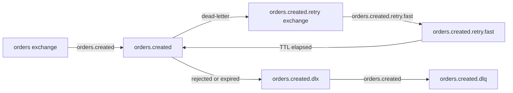

# SphereRabbitMQ CLI

`sprmq` is the command-line interface for `SphereRabbitMQ.IaC`.

Its scope is intentionally limited to RabbitMQ infrastructure:

- virtual hosts
- exchanges
- queues
- bindings
- dead-letter topology
- retry topology based on TTL and dead-letter reinjection
- export and reconciliation of broker topology

It does not provide runtime publisher/subscriber abstractions.

## Critical Scope Boundary

`sprmq` is the owner of RabbitMQ topology in this repository.

The runtime library does not create:

- virtual hosts
- exchanges
- queues
- bindings

That means:

- if the YAML does not define retry or dead-letter topology, the runtime will fail when configured to use it
- if a queue or exchange is missing on the broker, runtime code fails explicitly instead of creating it

## Build And Run

The recommended distribution model is a NuGet-hosted `dotnet tool` package published as `SphereRabbitMQ.IaC.Tool`.

Install globally:

```bash
dotnet tool install --global SphereRabbitMQ.IaC.Tool
sprmq --help
```

Or install it per repository with a local tool manifest:

```bash
dotnet new tool-manifest
dotnet tool install SphereRabbitMQ.IaC.Tool
dotnet tool restore
dotnet tool run sprmq -- --help
```

When the consuming repository already has a `NuGet.Config`, `dotnet tool restore` resolves the package from the configured feeds, including `https://api.nuget.org/v3/index.json` when published there.

For local development in this repository you can still publish the standalone CLI through the VS Code task `publish sprmq cli`.

The published binary is generated in `./cli`:

```bash
./cli/sprmq --help
```

During development, you can still use:

```bash
dotnet run --project src/SphereRabbitMQ.IaC.Cli -- --help
```

## Commands

### `init`

Creates a topology YAML file from a built-in template.

Available templates:

- `minimal`
- `quorum`
- `retry`
- `retry-dead-letter`
- `debug`
- `topic-routing`

Examples:

```bash
sprmq init --template minimal --output-file topology.yaml
sprmq init --template retry-dead-letter --output-file topology.yaml
sprmq init --template debug --output-file -
```

The same templates are also checked into the repository under `samples/templates/` for direct reuse and review.

### `validate`

Validates YAML syntax, normalization, and semantic consistency.

```bash
./cli/sprmq validate --file samples/minimal-topology.yaml
```

### `plan`

Reads desired topology, reads current broker state, and prints the reconciliation plan.

`plan` never changes broker state.

```bash
./cli/sprmq plan --file samples/minimal-topology.yaml
```

### `apply`

Builds the execution plan and applies only safe operations.

If the plan contains destructive or unsupported changes, `apply` stops and reports the blocking operations unless `--migrate` is provided

```bash
./cli/sprmq apply --file samples/minimal-topology.yaml
./cli/sprmq apply --file samples/minimal-topology.yaml --dry-run
./cli/sprmq apply --file samples/minimal-topology.yaml --verbose
./cli/sprmq apply --file samples/minimal-topology.yaml --migrate
```

### `apply --migrate`

`--migrate` enables broker-side reconciliation for resources that RabbitMQ cannot redeclare in place when immutable arguments differ.

Operational rules:

- an ephemeral per-virtual-host AMQP lock queue named `sprmq.migration.lock` is used to serialize migrations across concurrent CLI instances
- incompatible exchanges are deleted and recreated, then bindings are restored from the YAML definition
- generated debug queues are deleted and recreated without preserving messages
- generated retry/dead-letter queues are deleted and recreated without preserving messages
- mainstream queues use a temporary queue:
  - create a temporary queue and bind it with the same desired bindings
  - remove bindings from the old queue
  - move buffered messages from the old queue into the temporary queue
  - delete the old queue and create the new one
  - move messages from the temporary queue into the new queue before restoring bindings
  - restore bindings from the YAML definition
  - delete the temporary queue

If `--migrate` is not specified, the CLI keeps the current safe behavior and fails when an incompatible queue or exchange already exists on the broker.

### Safe Renames And Cleanup

Renaming an exchange or queue is not an in-place update in RabbitMQ. Treat it as a staged migration:

1. add the new resource to `virtualHosts`
2. bind existing queues or exchanges to the new resource
3. move publishers and consumers
4. explicitly retire the old resource through `decommission`

`decommission` is an explicit cleanup allowlist. Resources declared there are removed during `apply` without being reported as blocking destructive drift, and missing resources are treated as a no-op.

Example:

```yaml
virtualHosts:
  - name: sales
    exchanges:
      - name: orders.current
        type: topic
    queues:
      - name: orders.created
    bindings:
      - sourceExchange: orders.current
        destination: orders.created
        destinationType: queue
        routingKey: orders.created

decommission:
  virtualHosts:
    - name: sales
      exchanges:
        - orders.legacy
      bindings:
        - sourceExchange: orders.legacy
          destination: orders.created
          destinationType: queue
          routingKey: orders.created
```

Recommended lifecycle:

- release 1: create the new resource and keep the old one working
- release 2: add the old resource under `decommission`
- release 3: remove the `decommission` entry once cleanup is complete and no longer needs to be tracked

Operational consequences:

- `--migrate` is destructive by design for incompatible resources
- generated queues do not preserve messages
- mainstream queue migration tries to preserve buffered messages and binding order, but it is still an operational migration and should be scheduled carefully
- concurrent `--migrate` executions on the same virtual host are serialized through `sprmq.migration.lock`
- the migration lock queue is `exclusive` and `auto-delete`, so it disappears automatically when the CLI instance releases the connection

Example:

```bash
./cli/sprmq apply \
  --file samples/queue-ttl-and-debug-topology.yaml \
  --migrate \
  --verbose
```

### `destroy`

Builds and optionally executes a destroy plan for the topology described in the YAML file.

Real deletion requires `--allow-destructive`.

```bash
./cli/sprmq destroy --file samples/minimal-topology.yaml --dry-run
./cli/sprmq destroy --file samples/minimal-topology.yaml --allow-destructive
./cli/sprmq destroy --file samples/minimal-topology.yaml --allow-destructive --destroy-vhost
```

### `export`

Reads current broker topology and exports it as YAML.

```bash
./cli/sprmq export --file samples/minimal-topology.yaml
./cli/sprmq export --output-file exported-topology.yaml
./cli/sprmq export --include-broker --output-file topology.bootstrap.yaml
```

`--include-broker` makes the export bootstrap-friendly for developers by persisting the resolved broker section into the YAML output.

### `completion`

Prints a shell completion script for `bash`, `zsh`, or `pwsh`.

Examples:

```bash
sprmq completion bash
sprmq completion zsh
sprmq completion pwsh
```

Typical usage:

```bash
sprmq completion bash >> ~/.bashrc
sprmq completion zsh >> ~/.zshrc
```

## Broker Configuration Resolution

Broker connection values are resolved in this order:

1. command-line arguments
2. environment variables
3. YAML `broker` section
4. defaults or derived values

Supported environment variables:

- `SPHERE_RABBITMQ_MANAGEMENT_URL`
- `SPHERE_RABBITMQ_USERNAME`
- `SPHERE_RABBITMQ_PASSWORD`
- `SPHERE_RABBITMQ_VHOSTS`

The CLI prints the origin of each resolved value in text mode:

```text
Broker settings:
- managementUrl: http://localhost:31672/api/ (yaml)
- username: admin (environment)
- password: (command-line)
- virtualHosts: sales (yaml)
```

## Output Modes

### Text output

Default operator-friendly output.

Includes:

- tool banner
- connection target
- validation result
- plan or execution plan
- blocking changes when execution is not safe

### JSON output

Pipeline-friendly output:

```bash
./cli/sprmq plan --file samples/minimal-topology.yaml --output json
```

JSON output includes `blockingChanges` when the plan is not safely executable.

## Topology Conventions

The YAML format allows explicit values, but several defaults are intentionally conventional.

### Exchange defaults

- `type: topic` when omitted
- `durable: true` by default

### Queue defaults

- `type: classic` when omitted
- `durable: true` by default
- `ttl` is optional and maps to `x-message-ttl`

Example:

```yaml
queues:
  - name: orders.created
    ttl: "00:10:00"
```

### Naming convention policy

The `naming` block is optional and only needed when you want to override the built-in naming convention for generated retry and dead-letter artifacts.

Minimal/starter YAMLs can omit it entirely.

When omitted, these defaults are used:

```yaml
naming:
  separator: "."
  retryExchangeSuffix: "retry"
  retryQueueSuffix: "retry"
  deadLetterExchangeSuffix: "dlx"
  deadLetterQueueSuffix: "dlq"
```

### Debug queue generation

The optional `debugQueues` block generates one debug queue per exchange in each managed virtual host.

```yaml
debugQueues:
  enabled: true
  queueSuffix: debug
```

Debug queue conventions are fixed:

- queue name: `<exchange>.<queueSuffix>`
- queue type: `classic`
- queue durable: `true`
- binding routing key: `#`

This keeps debug topology deterministic across environments.

## Resilience Topology

Retry and dead-letter topology are broker-based and deterministic.

The tool can derive retry and dead-letter artifacts from high-level queue settings.

Example:

```yaml
queues:
  - name: orders.created
    type: quorum
    retry:
      enabled: true
      steps:
        - name: fast
          delay: "00:00:30"
    deadLetter:
      enabled: true
      ttl: "07:00:00"
```

The resulting topology is conceptually:



Operationally:

- the business queue dead-letters into the retry exchange
- each retry queue uses TTL
- when TTL expires, the message is dead-lettered back to the main flow
- dead-letter artifacts remain separate and visible in the plan
- if retry is enabled for a queue, dead-letter must also be enabled for that queue
- generated dead-letter topology always routes with the source queue name as routing key
- `deadLetter.routingKey` is not configurable for generated dead-letter topology
- the dead-letter queue can define its own optional `ttl`, which maps to `x-message-ttl`

Important restriction:

- `sprmq` can generate this topology from YAML
- the runtime expects it to already exist
- the runtime will not synthesize any missing retry or dead-letter resources on startup or on first failure

## Samples

Repository samples:

- `samples/minimal-topology.yaml`
- `samples/queue-ttl-and-debug-topology.yaml`

The second sample demonstrates:

- implicit exchange defaults
- queue TTL
- generated debug queues

## Safe Execution Model

The CLI is designed for CI/CD execution:

- deterministic output
- non-interactive behavior
- explicit dry-run support
- explicit destructive opt-in for `destroy`
- machine-readable JSON output
- no hidden destructive reconciliation during `apply`

If the tool detects a destructive or unsupported change, it prints the blocking operations and exits with a non-success code.

## Recommended Operator Rules

- use `plan` in CI before `apply`
- use `apply` without `--migrate` by default
- use `apply --migrate` only for reviewed incompatible changes
- treat generated queue recreation as message-destructive
- validate runtime subscribers against the exact retry and dead-letter topology declared in YAML
